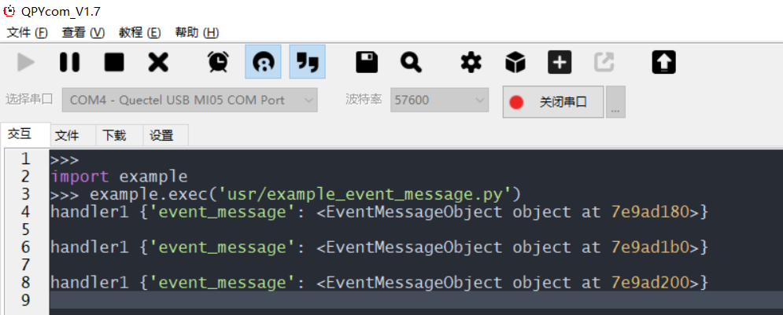

## event-manage消息队列

event-manage消息队列主要用于层级的消息派播,观察者模式的实现，支持提供消息队列的就派发服务、同步派发和异步派发机制、提供观察者模式支持  示例代码如下：

```python
from event_message import Event
import utime
"""
1. 初始化事件
2. 初始化事件管理器
3. 注册事件到事件管理器中
4. 开启事件管理器
5. 添加事件处理器
6. 派发数据
"""
from event_message import Event, EventManager
# 初始化事件和事件管理器
event = Event("test")
event_manager = EventManager()
# 注册事件
event_manager.register_event(event)
# 开启事件管理器
event_manager.start()
# 添加事件处理器, 这里注意可以批量注解不同的事件类型
@event.add_handler_via()
def handler(**kwargs):
    em = kwargs["event_message"]
    """
    第一种获取数据的方法
    kwargs:{
        "event_message":EventMessageObject
    }
    EventMessageObject 有四个属性
        event_name
        msg
        event
        callback
        提供了自己获取还有组合获取组合获取可调用下列方法,model_to_dict()会获取组合的字典内容如下
        {
            'name': 'test',
            'event': event_object,
            'msg': '1111',
            'callback': None
        }
    """
    
    print("handler1 {}".format(kwargs))
    """
    1. 第一种属性获取方式
        # 获取事件的名称
            event_name = em.event_name
        # 获取事件的消息内容
            msg = em.msg
        # 获取由来的事件
            ev = em.event
        # 获取传进来的callback不传默认为None
            cb = em.callback
    """
    """
    2. 第二种属性值获取方式(推荐)
        data_map = em.model_to_dict()
        数据格式如下
            {
                'name': 'test',
                'event': event_object,
                'msg': '1111',
                'callback': None
            }
    """
# 异步派发数据, 非阻塞
while True:
    event.post(message="1111")
    utime.sleep(2)
```

运行的效果如下图所示：



效果解释：

程序处于循环异步派发数据


