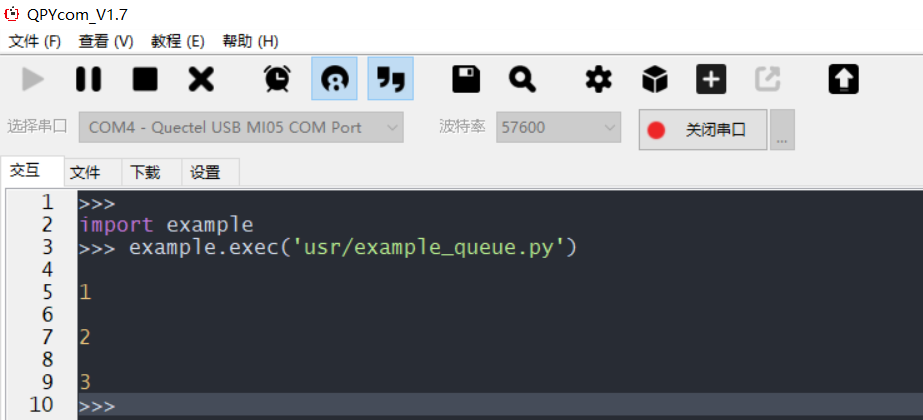

## Queue普通队列

Queue普通队列主要用于线程之间的通信，示例代码如下：

```python
import _thread
from queue import Queue
import utime
# 初始化队列
q = Queue(maxsize=100)
def get():
    while True:
# q.get 会阻塞等待消息过来每当有q.put执行完后 q.get会受到相关信号,解除阻塞往下执行
        item = q.get()
        print(item)
# 开启线程在哪等待消息
_thread.start_new_thread(get,())
# put消息到队列
q.put(1)
utime.sleep(2)
q.put(2)
utime.sleep(2)
q.put(3)
```

运行的效果如下图所示：

效果解释：

当线程A创建了queue，会一直阻塞等待get，直到另外一个线程B进行put，此时线程A会get数据。


